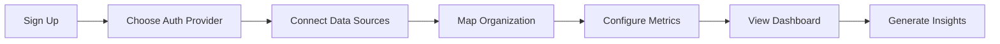

# Cloud Integration Strategy for Adaptive Organization Analysis
## Transform into Enterprise SaaS Platform

### 🎯 Vision
Transform the Adaptive Organization tool into a cloud-native SaaS platform that allows any organization to:
1. **Login** with enterprise SSO (Google, Microsoft, Salesforce)
2. **Connect** to their existing data sources
3. **Analyze** organizational flows automatically
4. **Monitor** sustainability metrics in real-time
5. **Optimize** based on AI recommendations

---

## 1. 🔐 Authentication & Identity Management

### Single Sign-On (SSO) Providers

#### Google Workspace Integration
```python
# Using google-auth library
from google.auth import oauth2
from google.workspace import admin_sdk

features = {
    'authentication': 'OAuth 2.0',
    'user_data': 'Google Directory API',
    'org_structure': 'Organizational Units',
    'activity_data': 'Reports API',
    'collaboration': 'Drive, Gmail, Calendar APIs'
}
```

**Data Available:**
- Organization hierarchy
- Email communication patterns
- Document collaboration flows
- Meeting patterns
- User activity metrics

#### Microsoft Azure AD / Office 365
```python
# Using msal library
from msal import PublicClientApplication
from msgraph import GraphClient

features = {
    'authentication': 'Azure AD OAuth',
    'user_data': 'Microsoft Graph API',
    'org_structure': 'Azure AD Groups',
    'activity_data': 'Office 365 Analytics',
    'collaboration': 'Teams, SharePoint, Exchange'
}
```

**Data Available:**
- Teams collaboration patterns
- Email/calendar flows
- SharePoint document flows
- Power BI metrics
- Dynamics 365 transactions

#### Salesforce Integration
```python
# Using simple-salesforce
from simple_salesforce import Salesforce

features = {
    'authentication': 'Salesforce OAuth',
    'crm_data': 'SOQL queries',
    'org_structure': 'Role Hierarchy',
    'activity_data': 'Activity History',
    'processes': 'Flow Builder data'
}
```

**Data Available:**
- Sales pipeline flows
- Customer interaction patterns
- Opportunity flows
- Case resolution paths
- Custom object relationships

---

## 2. 📊 Data Connectors Framework

### Universal Data Connector Architecture

```python
class DataConnector(ABC):
    @abstractmethod
    def authenticate(self, credentials):
        pass
    
    @abstractmethod
    def extract_org_structure(self):
        """Returns nodes and hierarchy"""
        pass
    
    @abstractmethod
    def extract_flows(self, start_date, end_date):
        """Returns flow matrix"""
        pass
    
    @abstractmethod
    def extract_metrics(self):
        """Returns performance metrics"""
        pass
```

### Supported Data Sources

#### 1. **ERP Systems**
- **SAP** (via SAP Cloud Platform APIs)
  - Financial flows
  - Supply chain data
  - HR processes
  
- **Oracle ERP Cloud** (via REST APIs)
  - Procurement flows
  - Project management
  - Financial transactions

- **NetSuite** (via SuiteTalk REST)
  - Order-to-cash flows
  - Procure-to-pay flows
  - Financial consolidation

#### 2. **Collaboration Platforms**
- **Slack** (via Web API)
  - Channel communication patterns
  - Message flows
  - App integrations
  
- **Microsoft Teams** (via Graph API)
  - Team collaboration patterns
  - Channel activities
  - Meeting analytics

- **Zoom** (via REST API)
  - Meeting patterns
  - Webinar engagement
  - Communication flows

#### 3. **Project Management**
- **Jira** (via REST API)
  - Issue flows
  - Sprint velocities
  - Team interactions
  
- **Asana** (via REST API)
  - Task dependencies
  - Project flows
  - Team collaboration

- **Monday.com** (via GraphQL API)
  - Board interactions
  - Workflow automations
  - Team activities

#### 4. **Data Warehouses**
- **Snowflake** (via Python Connector)
- **BigQuery** (via Python Client)
- **Redshift** (via psycopg2)
- **Databricks** (via REST API)

#### 5. **BI Tools**
- **Tableau** (via REST API)
- **Power BI** (via REST API)
- **Looker** (via API)
- **Qlik Sense** (via APIs)

---

## 3. 🏗️ Technical Architecture

### Cloud Infrastructure Options

#### Option 1: Google Cloud Platform
```yaml
services:
  - Cloud Run (containerized app)
  - Firestore (user data)
  - BigQuery (analytics)
  - Cloud Functions (ETL)
  - Identity Platform (auth)
  - Pub/Sub (real-time)
```

#### Option 2: AWS
```yaml
services:
  - ECS/Fargate (containers)
  - DynamoDB (user data)
  - Athena (analytics)
  - Lambda (ETL)
  - Cognito (auth)
  - Kinesis (streaming)
```

#### Option 3: Azure
```yaml
services:
  - Container Instances
  - Cosmos DB (data)
  - Synapse (analytics)
  - Functions (ETL)
  - Azure AD B2C (auth)
  - Event Hubs (streaming)
```

### Microservices Architecture

```
┌─────────────────────────────────────────────┐
│            Frontend (React/Next.js)          │
├─────────────────────────────────────────────┤
│              API Gateway                     │
├────────┬────────┬────────┬────────┬────────┤
│  Auth  │  Data  │ Analysis│ Report │Monitor │
│Service │Connector│ Engine │Generator│Service│
├────────┴────────┴────────┴────────┴────────┤
│          Message Queue (Kafka/RabbitMQ)     │
├─────────────────────────────────────────────┤
│     Data Lake (S3/GCS/Azure Storage)        │
└─────────────────────────────────────────────┘
```

---

## 4. 🔄 Data Pipeline & ETL

### Automated Data Flow Pipeline

```python
class OrganizationalDataPipeline:
    def __init__(self, connector_type):
        self.connector = self.get_connector(connector_type)
        
    async def run_pipeline(self):
        # 1. Extract
        org_data = await self.extract_organizational_data()
        
        # 2. Transform
        flow_matrix = await self.build_flow_matrix(org_data)
        
        # 3. Load
        await self.store_in_warehouse(flow_matrix)
        
        # 4. Analyze
        metrics = await self.run_analysis(flow_matrix)
        
        # 5. Alert
        await self.check_thresholds(metrics)
```

### Real-time vs Batch Processing

**Real-time Streams:**
- Slack messages
- Email flows  
- Teams chats
- Transaction logs

**Batch Processing:**
- Daily aggregations
- Weekly reports
- Monthly summaries
- Quarterly analysis

---

## 5. 🎨 User Experience Flow

### Onboarding Journey



### Dashboard Features

1. **Real-time Monitoring**
   - Live flow visualization
   - Sustainability gauges
   - Alert notifications
   - Trend analysis

2. **Historical Analysis**
   - Time series comparison
   - Pattern detection
   - Anomaly identification
   - Predictive forecasting

3. **Benchmarking**
   - Industry comparisons
   - Best practices
   - Peer analysis
   - Improvement suggestions

---

## 6. 💰 Monetization Strategy

### Pricing Tiers

#### Starter (Free)
- 1 data source
- 10 users
- Monthly analysis
- Basic metrics

#### Professional ($99/month)
- 5 data sources
- 100 users
- Weekly analysis
- Advanced metrics
- API access

#### Enterprise (Custom)
- Unlimited sources
- Unlimited users
- Real-time analysis
- Custom metrics
- White labeling
- SLA support

---

## 7. 🚀 Implementation Roadmap

### Phase 1: MVP (3 months)
- [ ] Google OAuth integration
- [ ] Basic data connectors (CSV, Google Sheets)
- [ ] Cloud deployment (Google Cloud Run)
- [ ] User dashboard
- [ ] Basic subscription model

### Phase 2: Enterprise Features (3 months)
- [ ] Microsoft Azure AD integration
- [ ] Salesforce connector
- [ ] Advanced analytics
- [ ] Team collaboration
- [ ] API development

### Phase 3: Scale (6 months)
- [ ] All major data connectors
- [ ] Real-time processing
- [ ] ML recommendations
- [ ] Industry benchmarks
- [ ] White label option

---

## 8. 🔒 Security & Compliance

### Security Features
- End-to-end encryption
- Data residency options
- Role-based access control
- Audit logging
- MFA enforcement

### Compliance
- GDPR (Europe)
- CCPA (California)
- SOC 2 Type II
- ISO 27001
- HIPAA (healthcare)

---

## 9. 🤖 AI Enhancement Opportunities

### Machine Learning Features
1. **Anomaly Detection**
   - Unusual flow patterns
   - Bottleneck prediction
   - Risk identification

2. **Optimization Suggestions**
   - Reorganization recommendations
   - Flow optimization
   - Resource allocation

3. **Predictive Analytics**
   - Future state modeling
   - Scenario planning
   - Impact analysis

4. **Natural Language Insights**
   - Automated report generation
   - Voice-activated queries
   - Chatbot assistance

---

## 10. 📝 Next Steps

### Immediate Actions

1. **Technical POC**
   ```python
   # Create proof of concept for Google OAuth
   from flask import Flask
   from authlib.integrations.flask_client import OAuth
   
   app = Flask(__name__)
   oauth = OAuth(app)
   google = oauth.register(
       name='google',
       client_id='YOUR_CLIENT_ID',
       client_secret='YOUR_CLIENT_SECRET',
       # ... configuration
   )
   ```

2. **Market Validation**
   - Interview 10 potential customers
   - Identify killer features
   - Validate pricing model

3. **Partnership Development**
   - Apply for Google Cloud credits
   - Join Microsoft for Startups
   - Explore Salesforce AppExchange

4. **Technical Architecture**
   - Design microservices
   - Set up CI/CD pipeline
   - Create containerized deployment

### Key Decisions Needed

1. **Primary Cloud Provider?**
   - GCP (best for Google Workspace integration)
   - AWS (most mature, wide adoption)
   - Azure (best for Microsoft ecosystem)

2. **Initial Target Market?**
   - SMBs using Google Workspace
   - Enterprises using Microsoft 365
   - Tech companies using modern stack

3. **Development Approach?**
   - Full rewrite in React/Node.js
   - Gradual migration from Streamlit
   - Hybrid approach with embedded analytics

4. **Data Storage Strategy?**
   - Customer data isolation
   - Multi-tenant architecture
   - Regional deployment options

---

## Sample Integration Code

### Google Workspace Flow Extraction

```python
from google.oauth2 import service_account
from googleapiclient.discovery import build
import networkx as nx
import numpy as np

class GoogleWorkspaceConnector:
    def __init__(self, credentials_file):
        self.creds = service_account.Credentials.from_service_account_file(
            credentials_file,
            scopes=['https://www.googleapis.com/auth/admin.reports.audit.readonly']
        )
        
    def extract_email_flows(self, domain, days=30):
        """Extract email communication flows"""
        service = build('admin', 'reports_v1', credentials=self.creds)
        
        # Get email activities
        activities = service.activities().list(
            userKey='all',
            applicationName='gmail',
            maxResults=1000
        ).execute()
        
        # Build flow matrix from email patterns
        return self.build_flow_matrix(activities)
        
    def extract_drive_collaboration(self):
        """Extract document collaboration patterns"""
        service = build('drive', 'v3', credentials=self.creds)
        
        # Get shared documents and access patterns
        # Build collaboration network
        pass
```

### Salesforce Flow Extraction

```python
from simple_salesforce import Salesforce
import pandas as pd

class SalesforceConnector:
    def __init__(self, username, password, security_token):
        self.sf = Salesforce(
            username=username,
            password=password,
            security_token=security_token
        )
    
    def extract_opportunity_flows(self):
        """Extract sales pipeline flows"""
        query = """
            SELECT Id, Name, StageName, Amount, 
                   CreatedDate, CloseDate, OwnerId, AccountId
            FROM Opportunity
            WHERE CreatedDate = LAST_N_DAYS:90
        """
        
        opportunities = self.sf.query(query)
        return self.build_pipeline_flows(opportunities)
    
    def extract_case_flows(self):
        """Extract customer service flows"""
        query = """
            SELECT Id, CaseNumber, Status, Priority,
                   CreatedDate, ClosedDate, OwnerId
            FROM Case
            WHERE CreatedDate = LAST_N_DAYS:30
        """
        
        cases = self.sf.query(query)
        return self.build_support_flows(cases)
```

---

This strategy transforms your tool into a powerful enterprise SaaS platform that can automatically analyze any organization's health by connecting to their existing systems!